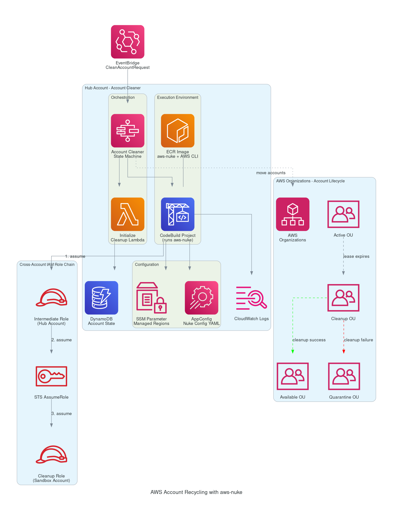
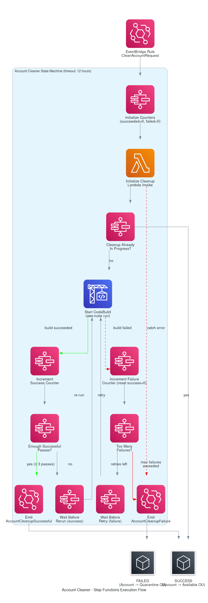

# AWS Account Recycling with aws-nuke

## Table of Contents

- [What is aws-nuke](#what-is-aws-nuke)
- [Current State (April 2026)](#current-state-april-2026)
- [Key Features in v3](#key-features-in-v3)
- [How Innovation Sandbox on AWS Implements aws-nuke](#how-innovation-sandbox-on-aws-implements-aws-nuke)
  - [Architecture Pattern](#architecture-pattern)
  - [1. Trigger Mechanism](#1-trigger-mechanism)
  - [Step Functions Execution Flow Diagram](#step-functions-execution-flow-diagram)
  - [2. Step Functions Orchestration](#2-step-functions-orchestration-the-retry-loop)
  - [3. CodeBuild Execution](#3-codebuild-execution-where-aws-nuke-actually-runs)
  - [4. Cross-Account IAM Role Chain](#4-cross-account-iam-role-chain)
  - [5. aws-nuke Configuration](#5-aws-nuke-configuration)
  - [6. Docker Image](#6-docker-image)
- [What You Need for Your Own Account Recycling Solution](#what-you-need-for-your-own-account-recycling-solution)
  - [AWS Infrastructure](#aws-infrastructure)
  - [IAM Setup](#iam-setup)
  - [aws-nuke Configuration](#aws-nuke-configuration-1)
  - [Multi-Pass Retry Logic](#multi-pass-retry-logic)
  - [Container Image](#container-image)
  - [Account Lifecycle Management](#account-lifecycle-management)
  - [Operational Concerns](#operational-concerns)
- [References](#references)

---

## What is aws-nuke

**aws-nuke** is an open-source CLI tool that removes all resources from an AWS account in an automated, systematic way. It is written in Go and licensed under MIT.

Common use cases:

- **Account cleanup** — Wiping dev/test/sandbox AWS accounts of all resources to avoid cost accumulation and security risks.
- **Terraform state corruption recovery** — When IaC state is lost or corrupted, aws-nuke can clean the account so you can start fresh.
- **Sandbox account recycling** — AWS's own Innovation Sandbox on AWS solution uses aws-nuke under the hood via CodeBuild to clean accounts after leases expire.

> **Warning:** This is an extremely destructive tool. It will delete everything in an AWS account that isn't explicitly filtered out. It should never be pointed at a production account without extreme caution and thorough filter configuration.

## Current State (April 2026)

| Detail | Value |
|---|---|
| Active maintainer | [ekristen/aws-nuke](https://github.com/ekristen/aws-nuke) |
| Stars / Forks | 1.3k / 125 |
| Latest version | v3.64.1 (March 31, 2026) |
| Total releases | 202 |
| Original project | [rebuy-de/aws-nuke](https://github.com/rebuy-de/aws-nuke) — archived October 15, 2024 (read-only) |
| Language | Go (99.8%) |
| License | MIT |

The ekristen fork is the actively maintained successor of the original rebuy-de project.

## Key Features in v3

- **Massive resource coverage** — Supports hundreds of AWS resource types (EC2, S3, IAM, Lambda, RDS, Bedrock, EKS, CloudFormation, and many more).
- **Global Filters** — Apply filters across all accounts in a single config block.
- **Run against all enabled regions** automatically.
- **Bypass Alias Check** — Skip the account alias safety check when needed.
- **Filter Groups** (experimental) — Group filter logic for complex scenarios.
- **Signed binaries** — All releases are signed with cosign.
- **libnuke** — The core was rewritten as a standalone library ([ekristen/libnuke](https://github.com/ekristen/libnuke)) with 95%+ test coverage, also powering [azure-nuke](https://github.com/ekristen/azure-nuke) and an upcoming gcp-nuke.
- **Homebrew install:** `ekristen/tap/aws-nuke@3`
- **Breaking change from v2:** `root` command no longer triggers the run — must use subcommand `run` (alias: `nuke`).

---

## How Innovation Sandbox on AWS Implements aws-nuke

### Architecture Diagram



### Architecture Pattern

The solution uses a **3-layer orchestration**: EventBridge → Step Functions → CodeBuild → aws-nuke.

```
EventBridge Event (CleanAccountRequest)
    │
    ▼
Step Functions (Account Cleaner State Machine)
    │
    ├── 1. Initialize Cleanup Lambda (pre-cleanup actions)
    │
    ├── 2. CodeBuild (runs aws-nuke in Docker container)
    │       │
    │       ├── Fetch nuke config from AppConfig
    │       ├── Inject runtime values (account ID, role, regions)
    │       ├── Assume intermediate role → assume sandbox role
    │       └── Execute aws-nuke
    │
    ├── 3. Retry loop (multiple passes)
    │       │
    │       ├── On success: increment counter, wait, re-run
    │       └── On failure: increment counter, wait, retry or give up
    │
    └── 4. Emit result event
            │
            ├── Success → Account moves to Available OU
            └── Failure → Account moves to Quarantine OU
```

### 1. Trigger Mechanism

- An **EventBridge event** (`CleanAccountRequest`) is emitted when an account lease expires or during onboarding.
- An **EventBridge rule** catches this event and triggers the Account Cleaner Step Function.

### Step Functions Execution Flow Diagram

The following diagram shows the exact state machine execution flow as implemented in the Innovation Sandbox solution, derived from the [source code](https://github.com/aws-solutions/innovation-sandbox-on-aws/blob/main/source/infrastructure/lib/components/account-cleaner/step-function.ts).



**State-by-state walkthrough:**

1. **Initialize Counters** (`Pass`) — Sets `succeeded=0` and `failed=0` execution result counters.
2. **Initialize Cleanup Lambda** (`LambdaInvoke`) — Runs pre-cleanup logic: checks if cleanup is already in progress, fetches global config (retry counts, wait durations). If this Lambda throws any error, the flow jumps directly to emitting a failure event.
3. **Cleanup Already In Progress?** (`Choice`) — If `cleanupAlreadyInProgress == true`, the state machine exits with `SUCCESS` immediately (avoids duplicate runs). Otherwise, proceeds to CodeBuild.
4. **Start CodeBuild** (`Task`, sync) — Launches the CodeBuild project that runs aws-nuke. Passes environment variables (account ID, AppConfig IDs) and waits for completion.
5. **On CodeBuild success:**
   - **Increment Success Counter** (`Pass`) — `succeeded += 1`.
   - **Enough Successful Passes?** (`Choice`) — If `succeeded >= numberOfSuccessfulAttemptsToFinishCleanup` (default: 3), emit success event. Otherwise, wait and re-run CodeBuild.
   - **Wait Before Rerun** (`Wait`) — Configurable delay (`waitBeforeRerunSuccessfulAttemptSeconds`) before the next pass.
6. **On CodeBuild failure** (caught error):
   - **Increment Failure Counter** (`Pass`) — `failed += 1`, resets `succeeded = 0` (consecutive successes must restart).
   - **Too Many Failures?** (`Choice`) — If `failed < numberOfFailedAttemptsToCancelCleanup`, wait and retry. Otherwise, emit failure event.
   - **Wait Before Retry** (`Wait`) — Configurable delay (`waitBeforeRetryFailedAttemptSeconds`) before retrying.
7. **Emit AccountCleanupSuccessful** (`EventBridgePutEvents`) → State machine ends with `SUCCESS`. Account moves to **Available OU**.
8. **Emit AccountCleanupFailure** (`EventBridgePutEvents`) → State machine ends with `FAILED`. Account moves to **Quarantine OU**.

### 2. Step Functions Orchestration (the retry loop)

- A **pre-cleanup Lambda** (`InitializeCleanupLambda`) runs first to:
  - Perform pre-cleanup actions.
  - Check if cleanup is already in progress (concurrency guard).
  - Fetch global config (retry counts, wait times).
- **CodeBuild is invoked** to run aws-nuke against the target account.
- On **success**: increments a success counter, waits a configurable delay, then re-runs CodeBuild again — repeating until the configured number of successful passes is reached (default: 3 passes).
- On **failure**: increments a failure counter, waits a configurable delay, retries — but if failures exceed the configured max, it stops and emits a failure event.
- On **final success**: emits `AccountCleanupSuccessful` event → account moves to the **Available** OU.
- On **final failure**: emits `AccountCleanupFailure` event → account moves to **Quarantine** OU for manual investigation.
- Step Function timeout: **12 hours**.

### 3. CodeBuild Execution (where aws-nuke actually runs)

Uses a custom Docker image (Amazon Linux 2023 minimal) with aws-nuke v3.64.1 built from source.

The buildspec does the following in order:

1. **Fetches the nuke config YAML from AWS AppConfig** (not baked into the image — it's dynamic).
2. **Injects runtime values** into the config via `sed` (hub account ID, cleanup account ID, cleanup role name).
3. **Dynamically populates regions** from an SSM Parameter that stores the managed regions list.
4. **Assumes an intermediate IAM role** in the hub account (role chaining).
5. **Assumes a cleanup role** in the target sandbox account via the intermediate role.
6. **Runs aws-nuke** with flags: `--no-dry-run --no-alias-check --force --profile cleanup --log-format=json`.

CodeBuild timeout: **60 minutes** per run.

### 4. Cross-Account IAM Role Chain

```
CodeBuild Role (Hub Account)
    │
    ▼ sts:AssumeRole
Intermediate Role (Hub Account)
    │
    ▼ sts:AssumeRole
Sandbox Account Cleanup Role (Target Sandbox Account)
```

This two-hop pattern is used because CodeBuild runs in the hub account and needs to reach into sandbox accounts.

### 5. aws-nuke Configuration

- **Detailed breakdown:** [nuke-config.md](./nuke-config.md)
- Stored in **AWS AppConfig** as a configuration profile (not a static file).
- Contains placeholders (`%HUB_ACCOUNT_ID%`, `%CLEANUP_ACCOUNT_ID%`, `%CLEANUP_ROLE_NAME%`) that are replaced at runtime.
- **Filters are configured** to protect solution-managed resources (so aws-nuke doesn't delete the cleanup role itself or other ISB infrastructure).
- Regions list is populated dynamically from SSM Parameter Store.

### 6. Docker Image

- Built from source with **optional patches** (the `patches/` directory allows the solution to patch aws-nuke source before compiling).
- Can use either a **public ECR image** (managed by AWS) or a **private ECR repository** (for custom builds).
- The private ECR option is toggled via environment variables (`PRIVATE_ECR_REPO`, `PRIVATE_ECR_REPO_REGION`).
- Image contents: Amazon Linux 2023 minimal + aws-nuke binary + AWS CLI + jq + sed.

---

## What You Need for Your Own Account Recycling Solution

**Implementation tasks breakdown:** [ars-tasks.md](./ars-tasks.md)

### AWS Infrastructure

1. **AWS Organizations** — Accounts must be in an org so you can move them between OUs.
2. **Organizational Units** — At minimum: Active, Cleanup, Available, and Quarantine OUs.
3. **Service Control Policies** — On the Cleanup OU to restrict what can happen during cleanup, and on sandbox OUs to prevent users from creating hard-to-delete resources.
4. **AWS Step Functions** — To orchestrate the multi-pass cleanup loop with retry/failure logic.
5. **AWS CodeBuild** — To run aws-nuke in a containerized environment with sufficient timeout (60 min per pass).
6. **Amazon EventBridge** — For event-driven triggering and result routing.
7. **AWS AppConfig or S3** — To store the aws-nuke YAML config externally (not baked into the image).
8. **SSM Parameter Store** — To store dynamic config like managed regions list.
9. **CloudWatch Logs** — For cleanup logging and debugging.

### IAM Setup

10. **Intermediate IAM role** in your hub/management account that CodeBuild can assume.
11. **Cleanup IAM role** in each sandbox account that the intermediate role can assume — must have broad permissions to list and delete resources.
12. **Trust policies** on both roles allowing the role chain: CodeBuild → Intermediate → Sandbox.
13. The cleanup role in sandbox accounts must **not be deletable by aws-nuke** (must be in the nuke config filters).

### aws-nuke Configuration

14. **YAML config file** with:
    - Target account ID(s).
    - Regions to scan.
    - **Resource filters** to protect infrastructure you don't want deleted (the cleanup role itself, org-managed resources, any baseline resources).
    - Account blocklist (to prevent accidental runs against production accounts).
15. **`--no-alias-check`** flag since sandbox accounts may not have aliases.
16. **`--no-dry-run --force`** flags for automated (non-interactive) execution.
17. **`--log-format=json`** for machine-parseable output.

### Multi-Pass Retry Logic

18. **Multiple successful passes** (Innovation Sandbox defaults to 3) — because:
    - First pass may fail on resources with dependencies (e.g., can't delete a VPC until subnets are gone).
    - Some deletions create new resources (e.g., RDS final snapshots, CloudFormation OnDelete custom resources).
    - Dependency ordering resolves itself across passes.
19. **Configurable failure threshold** — How many consecutive failures before giving up and quarantining.
20. **Wait intervals** between passes — Configurable delays between success reruns and failure retries.

### Container Image

21. **Docker image** with aws-nuke binary, AWS CLI, jq, and sed installed.
22. Host in **ECR** (public or private) accessible by CodeBuild.
23. Pin to a **specific aws-nuke version** with checksum verification for reproducibility.

### Account Lifecycle Management

24. **State tracking** — A database (DynamoDB or similar) to track account states: Active, Cleanup, Available, Quarantine.
25. **OU movement logic** — Lambda functions to move accounts between OUs based on cleanup results.
26. **Quarantine handling** — A process for admins to manually investigate and remediate accounts where cleanup failed.
27. **Drift detection** — Periodic checks that account state in your database matches actual OU placement.

### Operational Concerns

28. **Notifications** — Email/Slack alerts on cleanup success, failure, and quarantine events.
29. **Logging and auditing** — All cleanup runs should be logged for compliance.
30. **Cost monitoring** — Track sandbox account spend to trigger cleanup at budget thresholds.
31. **Concurrency control** — Prevent multiple simultaneous cleanups on the same account (Innovation Sandbox checks `cleanupAlreadyInProgress`).

---

## References

- [ekristen/aws-nuke GitHub](https://github.com/ekristen/aws-nuke)
- [aws-nuke Documentation](https://aws-nuke.ekristen.dev/)
- [Innovation Sandbox on AWS — Account Cleaner Components](https://docs.aws.amazon.com/solutions/latest/innovation-sandbox-on-aws/account-cleaner-component.html)
- [Innovation Sandbox on AWS — Architecture Overview](https://docs.aws.amazon.com/solutions/latest/innovation-sandbox-on-aws/architecture-overview.html)
- [Innovation Sandbox on AWS — Event Infrastructure](https://docs.aws.amazon.com/solutions/latest/innovation-sandbox-on-aws/event-infra.html)
- [Innovation Sandbox on AWS — Concepts and Definitions](https://docs.aws.amazon.com/solutions/latest/innovation-sandbox-on-aws/concepts-and-definitions.html)
- [Innovation Sandbox on AWS — Source Code](https://github.com/aws-solutions/innovation-sandbox-on-aws)
- [rebuy-de/aws-nuke (archived original)](https://github.com/rebuy-de/aws-nuke)
- [libnuke Library](https://github.com/ekristen/libnuke)
